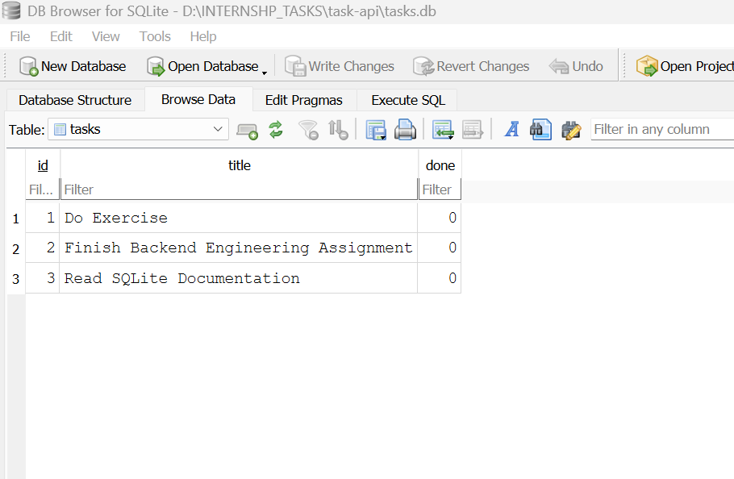

# Task API

A simple CRUD API for managing a to-do list, built with Python and FastAPI as part of a backend engineering assignment. Task data is stored in a SQLite database (`tasks.db`) and survives server restarts.

## Tech Stack
- Python 3.13
- FastAPI
- Uvicorn (ASGI server)
- SQLite

## Setup & Run

Clone the repo and set up a virtual environment:

```bash
git clone https://github.com/NoorFatima-Abbas/task-api.git
cd task-api
python -m venv venv
venv\Scripts\activate          # Windows
pip install fastapi uvicorn
```

Start the server:

```bash
uvicorn main:app --reload --port 8000
```

On first run, `tasks.db` is created automatically with 3 seeded example tasks. Visit `http://localhost:8000` in your browser, or explore the interactive API docs at `http://localhost:8000/docs`.

## Endpoints

| Method | Path             | Description                          | Success | Errors        |
|--------|------------------|---------------------------------------|---------|---------------|
| GET    | `/`              | API info (name, version, endpoints)   | 200     | —             |
| GET    | `/health`        | Health check                          | 200     | —             |
| GET    | `/tasks`         | List all tasks                        | 200     | —             |
| GET    | `/tasks/{id}`    | Get a single task by ID               | 200     | 404           |
| POST   | `/tasks`         | Create a new task                     | 201     | 400           |
| PUT    | `/tasks/{id}`    | Update a task's title and/or status   | 200     | 400, 404      |
| DELETE | `/tasks/{id}`    | Delete a task                         | 204     | 404           |

## Example: curl
curl.exe -i http://localhost:8000/tasks/1

HTTP/1.1 200 OK
date: Fri, 28 Aug 2026 05:22:08 GMT
server: uvicorn
content-length: 43
content-type: application/json

{"id":1,"title":"Do Exercise","done":false}


## Swagger UI

All 7 endpoints are documented and testable via "Try it out" at `/docs`.


## Database

Task data lives in `tasks.db` (SQLite), created automatically the first time the app runs. It's git-ignored, so each fresh clone starts with its own database, seeded with 3 example tasks.

SQLite was chosen because it needs no separate server or install — the entire database is one file, which is enough for a project this size and removes any setup friction for anyone cloning the repo.


## Notes

SQLite makes all changes — creates, updates, deletes — permanent across restarts. For example, if you delete 2 of the original 5 tasks and restart the server, you'll still see exactly the remaining 3 — nothing is lost and nothing reappears on its own.

The one exception: if deletions ever bring the table down to zero rows, the app's startup logic (`init_db()`) reseeds the 3 original example tasks. This is a deliberate safety feature so a fresh or fully emptied database is never left completely blank — not a general "everything resets" behavior.

## Stage 4 — Exploring SQLite by hand

Query: `SELECT * FROM tasks WHERE done = 1;`
Result: returned zero rows before any task was marked complete, confirming the query correctly filters on the `done` column.

## Stage 5 — Publish & Document
Covered above: why SQLite (Database section), run command (Setup & Run), screenshot below, Stage 4 query above

## Stage 6 — AI vs Me

**Prompt used:** (pasted my real in-memory `main.py` + migration requirements: SQLite schema, create-if-missing, seed-once, identical endpoint behavior, 400/404 rules, parameterized queries, output isolated to `ai-version/`)

**What the AI did well:**
- Correct 400/404 error shapes and messages, matching mine exactly
- Parameterized queries throughout, no string-glued SQL
- Seed-only-if-empty logic worked correctly across multiple runs

**What it got wrong:**
- Returned `done` as raw `0`/`1` instead of a JSON boolean (`true`/`false`) — a silent behavior change from the original API that my version avoided by wrapping with `bool(row["done"])`.

**What my prompt left it to decide:**
- Added `AUTOINCREMENT` and `NOT NULL`/`DEFAULT` constraints I never specified — harmless, but undocumented decisions.

**Improved prompt (one addition):** "Ensure the `done` field is returned as a JSON boolean (`true`/`false`), not a raw 0/1 integer, in every response."

