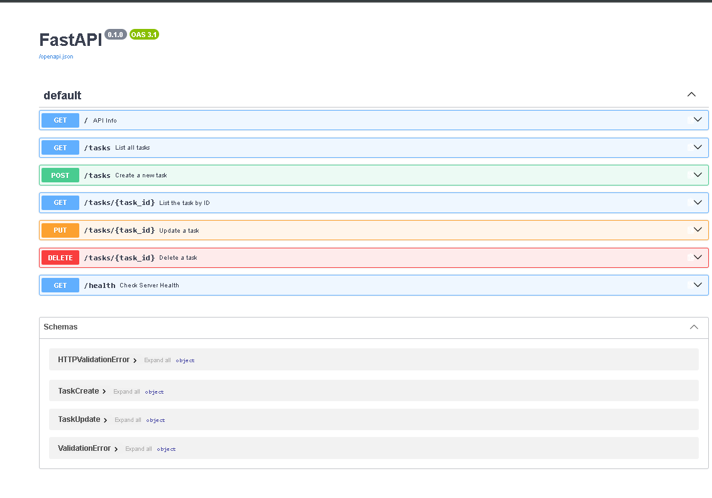

# Task API

A simple CRUD API for managing a to-do list, built with Python and FastAPI as part of a backend engineering assignment. Task data lives entirely in memory — it resets whenever the server restarts (see "Notes" below for why that's intentional, not a bug).

## Tech Stack
- Python 3.13
- FastAPI
- Uvicorn (ASGI server)

## Setup & Run

Clone the repo and set up a virtual environment:

```bash
git clone https://github.com/NoorFatima-Abbas/task-api.git
cd task-api
python -m venv venv
venv\Scripts\activate          # Windows
pip install fastapi uvicorn
```

Start the server:

```bash
uvicorn main:app --reload --port 8000
```

Visit `http://localhost:8000` in your browser, or explore the interactive API docs at `http://localhost:8000/docs`.

## Endpoints

| Method | Path             | Description                          | Success | Errors        |
|--------|------------------|---------------------------------------|---------|---------------|
| GET    | `/`              | API info (name, version, endpoints)   | 200     | —             |
| GET    | `/health`        | Health check                          | 200     | —             |
| GET    | `/tasks`         | List all tasks                        | 200     | —             |
| GET    | `/tasks/{id}`    | Get a single task by ID               | 200     | 404           |
| POST   | `/tasks`         | Create a new task                     | 201     | 400           |
| PUT    | `/tasks/{id}`    | Update a task's title and/or status   | 200     | 400, 404      |
| DELETE | `/tasks/{id}`    | Delete a task                         | 204     | 404           |

## Example: curl
curl.exe -i http://localhost:8000/tasks/1

HTTP/1.1 200 OK
date: Fri, 28 Aug 2026 05:22:08 GMT
server: uvicorn
content-length: 43
content-type: application/json

{"id":1,"title":"Assignment 2","done":true}


## Swagger UI

All 7 endpoints are documented and testable via "Try it out" at `/docs`.



## Notes

When the server restarts, only the 3 hardcoded example tasks reappear — 
any task created afterward and confirmed present in GET /tasks is completely gone once the server stops and starts again.
This happens because tasks are stored in a plain Python list in memory, which exists only for the lifetime of the running process; 
nothing is written to disk. This is exactly why real backends use a persistent store like SQLite or a proper database instead of an
in-memory list — so data survives restarts, deployments, and crashes, not just successful requests.

